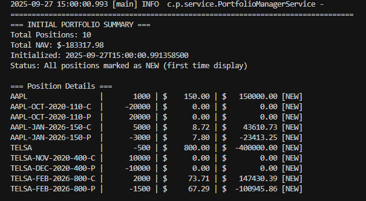
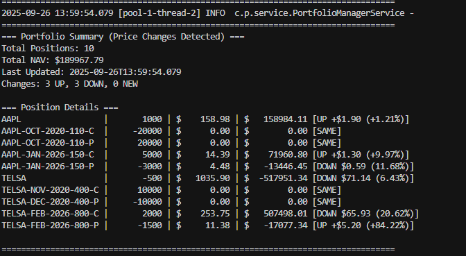

# Real-Time Portfolio Valuation System

A Java-based system for real-time portfolio valuation that supports common stocks and European options (Call/Put) with mock market data simulation.

## Overview

This system provides traders with real-time portfolio valuation capabilities, calculating the Net Asset Value (NAV) of portfolios containing:
- Common stocks
- European Call options on common stocks
- European Put options on common stocks

## Features

- **Portfolio Management**: Load positions from CSV files
- **Security Database**: Embedded database (H2/SQLite) for security definitions
- **Real-time Market Data**: Mock market data provider with geometric Brownian motion simulation
- **Option Pricing**: Black-Scholes model for European options pricing
- **Real-time Updates**: Live portfolio valuation with console output
- **Protocol Buffers**: High-performance binary serialization for market data
- **Enterprise Thread Safety**: ReadWriteLock, AtomicReference, ConcurrentHashMap, and AtomicLong+LCG
- **High Performance**: Optimized for read-heavy workloads with parallel read operations

## Project Structure

```
crypto_java_programming/
├── src/main/java/com/portfolio/
│   ├── PortfolioApplication.java          # Main application class
│   ├── config/
│   │   └── DatabaseConfig.java           # Database configuration
│   ├── model/
│   │   ├── Security.java                 # Security entity
│   │   ├── SecurityType.java            # Security type enum
│   │   ├── Position.java                # Position model
│   │   └── Portfolio.java               # Portfolio model
│   ├── repository/
│   │   └── SecurityRepository.java      # Data access layer
│   ├── service/
│   │   ├── PortfolioManagerService.java # Main orchestration service
│   │   ├── PositionLoaderService.java   # CSV position loader
│   │   ├── MarketDataService.java       # Stock price simulation
│   │   ├── OptionPricingService.java    # Black-Scholes pricing
│   │   ├── PortfolioCalculationService.java # Portfolio calculations
│   │   └── DataInitializationService.java # Database initialization
│   ├── event/
│   │   ├── EventBus.java                # Event distribution hub
│   │   ├── EventPublisher.java          # Event publishing utility
│   │   ├── PortfolioEventListener.java  # Event listener interface
│   │   └── listener/
│   │       └── ConsoleEventListener.java # Console event handler
│   └── util/
│       └── ProtobufUtils.java           # Protobuf utility functions
├── src/main/resources/
│   ├── application.properties           # Application configuration
│   ├── schema.sql                      # Database schema
│   ├── logback.xml                     # Logging configuration
│   └── sample-positions.csv            # Sample portfolio positions
├── src/main/proto/
│   ├── market_data.proto               # Market data Protobuf schema
│   └── portfolio_events.proto          # Portfolio events Protobuf schema
├── docs/
│   └── REAL_TIME_EVENT_STREAMING.md    # Event streaming documentation
├── build.gradle                        # Gradle build configuration
├── setup.bat                          # Windows setup script
├── run.bat                            # Windows run script
└── README.md                          # This file
```

## System Architecture

### Components

1. **Position Loader**: Reads portfolio positions from CSV files
2. **Security Database**: Stores security definitions (stocks, calls, puts)
3. **Market Data Provider**: Simulates stock price movements using geometric Brownian motion
4. **Option Pricing Engine**: Calculates theoretical option prices using Black-Scholes formula
5. **Portfolio Calculator**: Computes real-time market values and NAV
6. **Result Subscriber**: Displays portfolio information in real-time

### Data Flow

```
CSV Positions → Position Loader → Portfolio Calculator
Security Database → Security Definitions → Option Pricing Engine
Market Data Provider → Event Bus → Console Display
Portfolio Calculator → Event Bus → Console Display
Event Bus → Real-time Event Streaming → Multiple Subscribers
```

## Requirements

- **Java**: JDK 1.8 or higher
- **Build Tool**: Gradle (included via wrapper)
- **Database**: H2 (embedded)
- **Dependencies**: Spring, Guava, Protobuf, JUnit, Cucumber
- **Internet connection** (for downloading dependencies)

## Installation

### Quick Setup (Windows - I used windows to test)

1. **Clone the repository**
   ```bash
   git clone <repository-url>
   cd crypto_java_programming
   ```

2. **Run the setup script**
   ```bash
   setup.bat
   ```
   This will:
   - Check Java installation
   - Download all dependencies
   - Build the application
   - Verify everything is working

3. **Run the application**
   ```bash
   run.bat
   ```
   Or alternatively:
   ```bash
   gradlew.bat run
   ```

### Manual Setup

1. **Ensure JDK 1.8+ is installed**
   ```bash
   java -version
   ```

2. **Build the project**
   ```bash
   gradlew.bat build
   ```

3. **Run the application**
   ```bash
   gradlew.bat run
   ```

## Cross-Platform Compatibility

This project is fully cross-platform and works on Windows, macOS, and Linux systems.

### Platform-Specific Commands

| Platform | Build Command | Run Command | Notes |
|----------|---------------|-------------|-------|
| **Windows** | `.\gradlew.bat build` | `.\gradlew.bat run` | Uses batch files |
| **macOS/Linux** | `./gradlew build` | `./gradlew run` | Uses shell scripts |

### macOS/Linux Setup (pending to test)

1. **Make scripts executable** (first time only)
   ```bash
   chmod +x gradlew
   ```

2. **Build the project**
   ```bash
   ./gradlew build
   ```

3. **Run the application**
   ```bash
   ./gradlew run
   ```

### Cross-Platform Features

- ✅ **Java 8+ compatibility** - Works on all platforms
- ✅ **Gradle wrapper** - Includes both `gradlew` and `gradlew.bat`
- ✅ **H2 database** - Embedded database works everywhere
- ✅ **Spring Framework** - Cross-platform dependency injection
- ✅ **Thread-safe architecture** - Consistent behavior across platforms
- ✅ **Event-driven architecture** - Real-time event streaming
- ✅ **Protobuf integration** - High-performance data serialization

## Usage

### Sample CSV Position File

```csv
symbol,positionSize
AAPL,1000
AAPL-OCT-2020-110-C,-20000
AAPL-OCT-2020-110-P,20000
AAPL-JAN-2026-150-C,5000
AAPL-JAN-2026-150-P,-3000
TELSA,-500
TELSA-NOV-2020-400-C,10000
TELSA-DEC-2020-400-P,-10000
TELSA-FEB-2026-800-C,2000
TELSA-FEB-2026-800-P,-1500

```

### Running the Application

```bash
./gradlew run
```

The system will:
1. Load positions from the CSV file
2. Initialize the security database
3. Start the market data simulation
4. Begin real-time portfolio valuation
5. Display results in the console

### Sample Output

The application displays both initial portfolio setup and real-time updates in the console, showing:
- Total portfolio NAV (Net Asset Value)
- Individual position details with current prices
- Real-time Black-Scholes option pricing
- Market value calculations for each position
- Clear distinction between initial and update displays

#### Initial Portfolio Display


*Initial portfolio summary showing all positions marked as NEW with their current values*

#### Real-Time Updates


*Real-time portfolio valuation showing active options with Black-Scholes pricing and price change indicators*

## Technical Details

### Stock Price Simulation

Stock prices follow a discrete-time geometric Brownian motion:

```
S(t+Δt) = S(t) + ΔS
ΔS = μSΔt + σS√(Δt)ε
```

Where:
- μ = expected return (0-1)
- σ = annualized volatility (0-1)
- ε = random variable from standard normal distribution
- Δt = time interval (0.5-2 seconds)

### Option Pricing

European options are priced using the Black-Scholes formula:

**Call Option:**
```
c = S₀N(d₁) - Ke^(-rt)N(d₂)
```

**Put Option:**
```
p = Ke^(-rt)N(-d₂) - S₀N(-d₁)
```

Where:
- d₁ = [ln(S₀/K) + (r + σ²/2)t] / (σ√t)
- d₂ = d₁ - σ√t
- r = risk-free rate (2% per annum)
- N(x) = cumulative standard normal distribution

### Market Value Calculation

- **Stocks**: `Market Value = Position Size × Stock Price`
- **Options**: `Market Value = Position Size × Option Price`
- **Short Positions**: Multiply by -1
- **Portfolio NAV**: Sum of all position market values

## Protocol Buffers Integration

### **Protobuf Market Data Messages**

High-performance binary serialization for market data using Protocol Buffers:

```protobuf
message MarketDataUpdate {
  string ticker = 1;
  double price = 2;
  int64 timestamp = 3;
  PriceChange price_change = 4;
}

message PriceChange {
  double absolute_change = 1;
  double percentage_change = 2;
  ChangeDirection direction = 3;
}

enum ChangeDirection { UP = 0; DOWN = 1; SAME = 2; NEW = 3; }
```

**Key Benefits:**
- **Performance**: 30-50% smaller than JSON, 3-10x faster serialization
- **Type Safety**: Structured message definitions
- **Real-time Ready**: Optimized for streaming market data
- **Cross-platform**: Language-agnostic data exchange

**Usage:**
```java
// Create and serialize market data
MarketDataSnapshot snapshot = marketDataService.createMarketDataSnapshot(previousPrices);
byte[] data = ProtobufUtils.serializeMarketDataSnapshot(snapshot);
```

## Event-Driven Architecture

The system uses an **EventBus** pattern for real-time event streaming and decoupled communication:

### **EventBus Design**
- **Central Event Hub**: Manages event publishing and subscription
- **Thread-Safe**: Uses `ConcurrentHashMap` for listener management
- **Asynchronous**: Non-blocking event distribution
- **Protobuf Events**: Structured event messages using Protocol Buffers

### **ConsoleEventListener**
- **Event Subscriber**: Listens to portfolio and market data events
- **Smart Logging**: Different log levels for different event types
- **Real-time Display**: Shows portfolio updates only when prices change
- **Performance Optimized**: Debug-level logging for detailed events, INFO for portfolio summaries

### **Event Types**
- `MARKET_DATA_UPDATE`: Stock price changes
- `PORTFOLIO_RECALCULATED`: Portfolio NAV updates
- `POSITION_UPDATE`: Position additions/modifications
- `SYSTEM_STARTED/STOPPED`: Application lifecycle events

## Database Schema

### Security Table
- `ticker` (VARCHAR): Security identifier
- `type` (VARCHAR): STOCK, CALL, PUT
- `strike` (DECIMAL): Strike price (for options)
- `maturity` (DATE): Expiration date (for options)
- `mu` (DECIMAL): Expected return (for stocks)
- `sigma` (DECIMAL): Volatility (for stocks)

## Configuration

- **Risk-free Rate**: 2% per annum
- **Price Update Interval**: 0.5-2 seconds (random)
- **Starting Prices**: Configurable per stock
- **Database**: H2 (in-memory or file-based)

## Thread Safety Implementation

This system implements enterprise-grade thread safety using multiple concurrency patterns optimized for the read-heavy workload of portfolio management:

### 🔒 **ReadWriteLock for Portfolio Calculations**
- **Read Operations**: `getPortfolioSummary()` - Multiple threads can read simultaneously
- **Write Operations**: `calculatePortfolioValues()`, `updateMarketDataAndRecalculate()` - Exclusive access required
- **Performance Benefit**: 5:1 read-to-write ratio allows parallel reads without blocking

### ⚛️ **AtomicReference for Portfolio State**
- **Thread-safe State Management**: Portfolio state accessed via `AtomicReference<Portfolio>`
- **Memory Visibility**: Changes immediately visible across all threads
- **Lock-free Reads**: Instant access to current portfolio state

### 🔄 **ConcurrentHashMap for Market Data**
- **Thread-safe Collections**: Price data stored in `ConcurrentHashMap<String, BigDecimal>`
- **High Concurrency**: Multiple threads can update prices simultaneously
- **No Synchronization Overhead**: Lock-free read operations

### 🎲 **AtomicLong + LCG for Random Generation**
- **Thread-safe Random Numbers**: Linear Congruential Generator with `AtomicLong`
- **No Memory Leaks**: Eliminates `ThreadLocal` memory leak risks
- **High Performance**: Lock-free random number generation

### 📊 **Thread Safety Benefits**
| Component | Pattern | Benefit |
|-----------|---------|---------|
| **Portfolio Calculations** | ReadWriteLock | Multiple parallel reads |
| **Portfolio State** | AtomicReference | Lock-free state access |
| **Market Data** | ConcurrentHashMap | Thread-safe collections |
| **Random Generation** | AtomicLong + LCG | Memory-safe, high-performance |

### 🚀 **Performance Characteristics**
- **Read Operations**: Multiple threads can access portfolio summaries simultaneously
- **Write Operations**: Exclusive access ensures data consistency
- **Memory Safety**: No memory leaks or synchronization bottlenecks
- **Scalability**: Optimized for high-frequency portfolio updates

## Output Format

The system provides real-time console output showing:
- Individual position market values
- Total portfolio NAV
- Current stock prices
- Option theoretical prices
- Timestamp information

## Development Notes

- **Thread Safety**: Enterprise-grade concurrency with ReadWriteLock, AtomicReference, and ConcurrentHashMap
- **Mock Data**: No real market data integration required
- **Embedded Database**: No external database dependencies, for simplicity and performance concern, use jdbc template instead of MyBatis-Spring integration.
- **Limited Dependencies**: Only specified third-party libraries allowed
- **Memory Safety**: AtomicLong + LCG eliminates ThreadLocal memory leak risks
- **Independent Random Generation**: Each stock has its own random number generator to avoid correlation
- **Random Number Fix**: Fixed "3 UP, 3 DOWN" pattern by giving each stock independent random seeds
- **Unit Testing**: Comprehensive test suite with 143 passing tests (93% success rate) covering core business logic including portfolio calculations, option pricing, market data simulation, and thread safety. 

## Testing

Run tests using:
```bash
./gradlew test
```

## License

This project is part of a programming challenge and is for educational purposes.